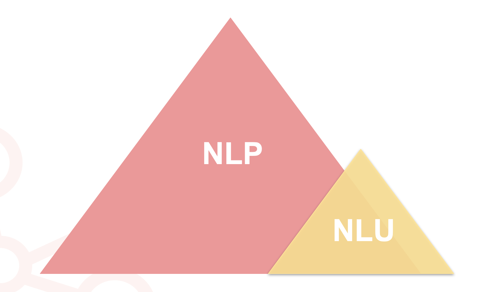
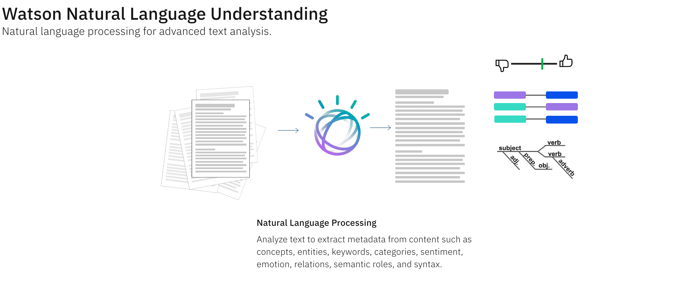

# NLP vs NLU : What’s the difference and what can we understand

### Pre-Req : 
- Sign up for IBM Cloud to get NLU Service : https://ibm.biz/nlpvsnlu

- Install Jupyter Notebook locally : https://jupyter.org/install

### Slides 
Google Slides : https://tinyurl.com/nlpnluslides

### NLU Demo 

Try NLU Demo [Here](https://www.ibm.com/demos/live/natural-language-understanding/self-service
)

[Create NLU Service for Free](https://cloud.ibm.com/catalog/services/natural-language-understanding)

### Resources 
- [Text Extension for Pandas](https://www.crowdcast.io/e/text-extensions)
- [Natural Language Processing Learning Path](https://developer.ibm.com/technologies/natural-language-processing/)
- [Python and Analytics Workshops](https://ibm-developer.gitbook.io/python-and-analytics/)